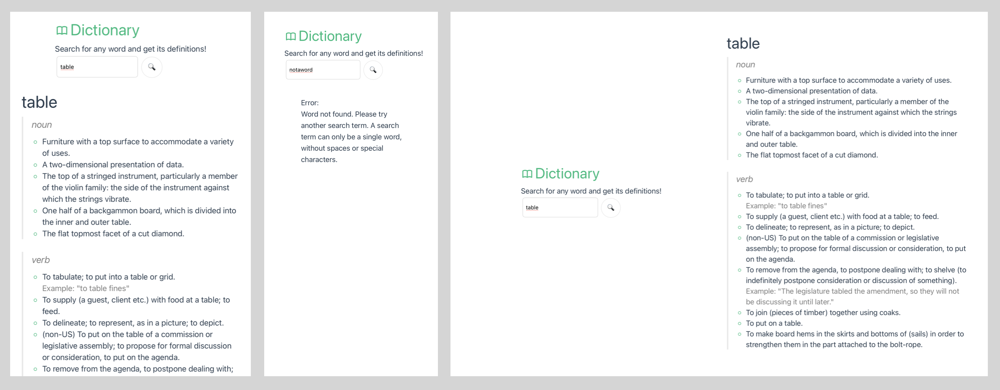

# simple-dictionary

Just fill in a word and you get its meaning and examples. Source for the dictionary is the [Free Dictionary API](https://dictionaryapi.dev/).

This was a micro challenge found on www.frontendmentor.io , and solved with use of Github Copilot for a quick prototype. Still, the copilot code was adjusted at all files.

Features: Fetch data from the API, display it in a user-friendly way, and handle errors gracefully.

